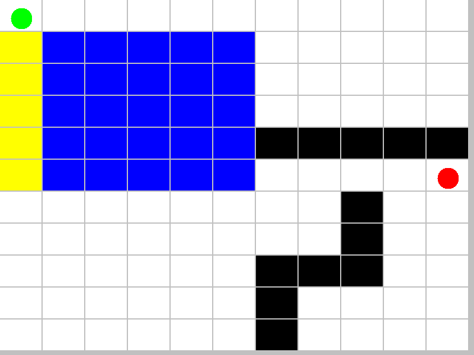

# Greedy and A* Algorithms to Help Robot Find its Destination

The goal of this project is to use heuristic search algorithms to plan a route for a robot. Then, integrate the system with the V-REP simulator.

Our project implements both the greedy search and the A* search algorithms in a grid map. This map is defined in the map.txt file and the symbols contained in the file are:

- **0** - Robot's initial position
- **G** - Robot's goal position
- **#** - Wall
- **.** - Empty cell (cost=1)
- **3** - Metal surface (cost=3)
- **X** - Sand surface (cost=10)
- **$** - Route found

To run the project without integrating with the simulator just run either ExecuteA.java or ExecuteGreedy.java. The output is an animation that shows the search process for the input map.

<b>A* Search:</b>

<b>Greedy Search:</b>

**Link of the V-REP Simulation:**

https://photos.google.com/share/AF1QipM1gNLXvaUU4ED2y3e_m-AUyi60K_QmZStkf-YyTGck_WN0rsZig6i0Wtht6x2Klw?key=SzVTcE41MTBtQ0hwdnZZX1lkRUttemliUEU5cDZR
